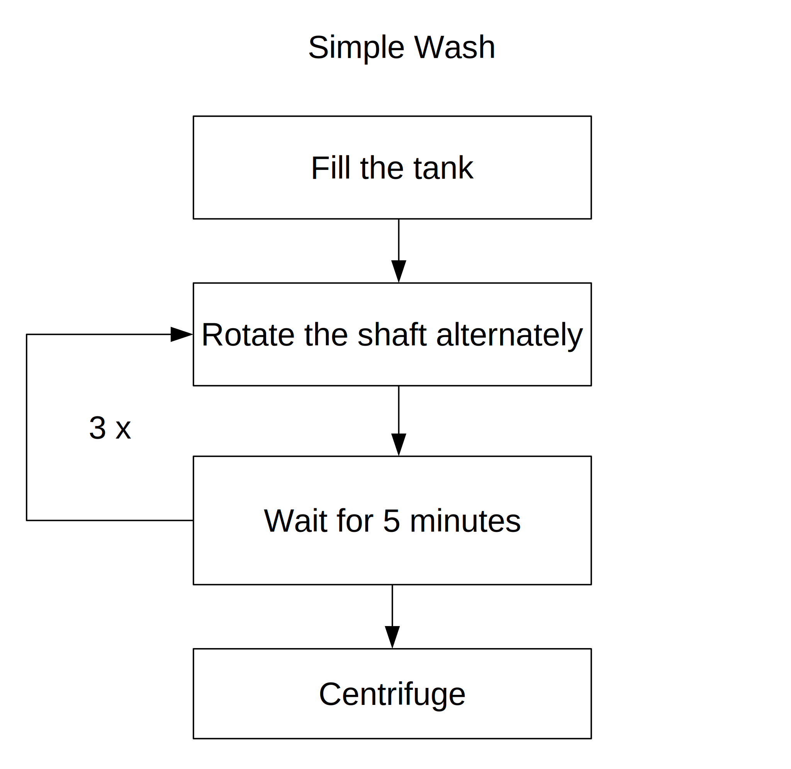

# Washing Machine code

This is a code intended to control a Colormaq Washing Machine 11 Kg with an
arduino uno. 

The mainboard of my washing machine fried after a electrical surge. I
discovered that the TRIACs were still working, so I made a board that could
fire their triggers using an Arduino. The schematic is provided in the file
`wash_machine.sch`.

The messages in the 20x4 LCD display are written in Portuguese, but the
comments and the serial messages are all in English.

## Features

Six modes are available:

- Simple Wash: The most basic washing process, it is depicted in **Figure 1**

- Normal Wash: Repeat the whole "Simple Wash" process three times, where only
  the first "wait step" of the first "Simple Wash" process  will be 15 min
  instead of 5 min.

- Delicate wash: Same as the Normal Wash, but the interval between two
  alternate shaft rotations is increased.

- Double Wash: Repeat "Simple Wash" two times.

- Just Centrifuge: Only performs centrifugation.

- Just Soak: Fill the tank and end the process.

**Figure 1**: "Simple Wash" flowchart

After finish the selected mode, the machine will emit a beep. If the tank takes
too long to fill, the machine will display an error on the LCD screen, beep for
a few seconds and stay on hold.

The machine displays a time estimation of the wash cycle, but it is imprecise.
I think it should be improved with a hardware clock module.

As interface, the project uses a 20x4 LCD to display the menu, a select button
and a start button. There are also serial messages for debug purposes.

